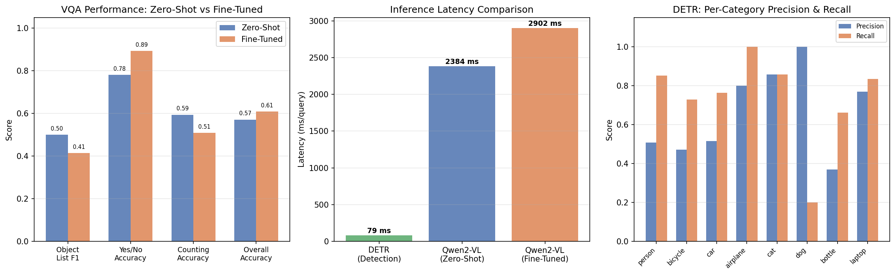
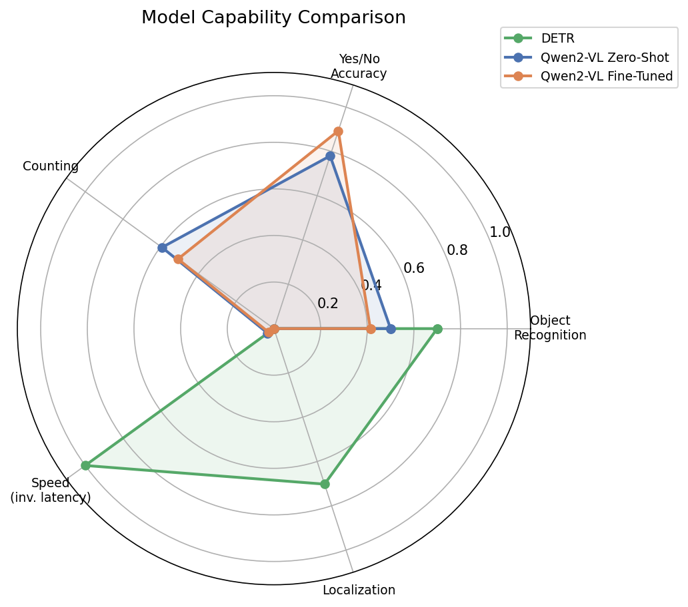

# VLM-Based Object Classification and Visual Question Answering

A computer vision project comparing **DETR object detection** against **Qwen2-VL vision-language model** (zero-shot and fine-tuned) on a COCO 2017 subset. Built entirely on Google Colab with a T4 GPU.

## Problem Statement

Traditional object detection models like DETR excel at localizing and classifying objects with bounding boxes, but cannot answer natural language questions about images. Vision Language Models (VLMs) offer a more flexible interface through visual question answering (VQA), but how do they compare in terms of accuracy and efficiency?

This project provides a structured, reproducible comparison across three approaches:
1. **DETR baseline** (pre-trained object detection)
2. **Qwen2-VL zero-shot** (VQA without task-specific training)
3. **Qwen2-VL fine-tuned** (VQA with QLoRA fine-tuning on COCO VQA pairs)

## Architecture Overview

```
COCO 2017 Val Subset (800 images, 8 categories)
         |
    80/20 split
    /          \
Train (640)   Test (160)
                |
    +-----------+-----------+
    |           |           |
  DETR      Qwen2-VL    Qwen2-VL
  ResNet-50  Zero-Shot   QLoRA Fine-Tuned
    |           |           |
  mAP/P/R    VQA Acc     VQA Acc
    |           |           |
    +-----+-----+-----+----+
          |
   Comparison & Analysis
```

**DETR Pipeline:** Pre-trained `facebook/detr-resnet-50` runs inference on test images, producing bounding boxes evaluated with mAP@50, precision, and recall via pycocotools.

**VLM Pipeline:** `Qwen/Qwen2-VL-2B-Instruct` answers three types of questions per image:
- "What objects are in this image?" (object recognition)
- "Is there a [category] in this image?" (presence detection)
- "How many [category]s are in this image?" (counting)

**Fine-Tuning:** QLoRA (4-bit NF4 quantization + LoRA r=16) on 500 training VQA pairs derived from COCO annotations, trained for 3 epochs.

## Dataset Details

| Property | Value |
|---|---|
| Source | COCO 2017 Validation Set |
| Total Images | 800 (sampled from 3,393 candidates) |
| Train / Test | 640 / 160 |
| Categories | person, car, dog, cat, bicycle, airplane, laptop, bottle |
| Annotations | 3,365 bounding box instances |
| VQA Pairs (Train) | 3,514 |
| VQA Pairs (Test) | 898 |

Category distribution is imbalanced, with "person" comprising ~72% of annotations, reflecting the natural COCO distribution.

## Results

### Comparison Table

| Metric | DETR Baseline | Qwen2-VL Zero-Shot | Qwen2-VL Fine-Tuned |
|---|---|---|---|
| mAP@50 | **0.7023** | N/A | N/A |
| Precision | 0.5021 | N/A | N/A |
| Recall | 0.8154 | N/A | N/A |
| Object List F1 | N/A | **0.5000** | 0.4133 |
| Yes/No Accuracy | N/A | 0.7799 | **0.8931** |
| Counting Accuracy | N/A | **0.5932** | 0.5085 |
| Overall VQA Accuracy | N/A | 0.5709 | **0.6082** |
| Latency (ms/query) | **79.5** | 2,384 | 2,902 |
| Parameters | 41M | 2.2B | 2.2B + 4.4M LoRA |

### Key Findings

- **Fine-tuning improved Yes/No accuracy by +11.3 percentage points** (78.0% to 89.3%), the largest gain across all metrics
- **DETR is 30x faster** than the VLM approaches, making it preferable for real-time detection tasks
- **Zero-shot VLM outperformed fine-tuned on counting and object listing**, suggesting the fine-tuning data format (short answers) may have reduced the model's descriptive capability
- **DETR achieves 0.70 mAP@50** on our subset, with strong performance on medium/large objects (0.83/0.96 AP) but weaker on small objects (0.35 AP)

### Sample Outputs

**DETR** detects and localizes objects with bounding boxes:


**Side-by-side comparison** of ground truth, DETR, and VLM predictions:


**Metric comparison charts:**


**Radar chart** showing each model's strengths:


## Limitations

1. **DETR:** High false positive rate on frequent categories (person, bottle); cannot answer natural language queries
2. **Qwen2-VL Zero-Shot:** Verbose responses complicate metric extraction; 30x slower than DETR; float16 instability on T4 required float32 fallback
3. **Qwen2-VL Fine-Tuned:** Slight regression on object listing F1 (0.50 to 0.41); occasional grounding token artifacts in responses; training loss near zero due to label masking issue
4. **General:** DETR and VLM solve fundamentally different tasks, limiting direct comparison; VQA accuracy depends on response parsing heuristics; 50-image eval subset may not capture full performance distribution

## Technical Stack

- Python 3.10+, PyTorch, HuggingFace Transformers
- **Detection:** DETR (`facebook/detr-resnet-50`)
- **VLM:** Qwen2-VL (`Qwen/Qwen2-VL-2B-Instruct`)
- **Fine-Tuning:** PEFT (LoRA/QLoRA), BitsAndBytes (4-bit quantization)
- **Dataset:** COCO 2017, pycocotools
- **Environment:** Google Colab Pro (T4 GPU, 16GB VRAM)

## Reproducibility

### Quick Start

1. Open the notebook in Google Colab (Pro recommended for T4 GPU)
2. Set runtime to **GPU (T4)**
3. Run cells sequentially (Phase 1 through Phase 5)
4. All data and results persist on Google Drive under `MyDrive/VLM_Object_Classification/`

### Requirements

```
torch>=2.0
transformers>=4.40
accelerate
peft
bitsandbytes
qwen-vl-utils
pycocotools
pillow
matplotlib
numpy
tqdm
```

### Project Structure

```
VLM_Object_Classification/
  coco_raw/                    # Raw COCO downloads
  coco_subset/
    metadata.json              # Split IDs, category maps
    train/
      images/                  # 640 training images
      annotations.json         # COCO-format annotations
      vqa_pairs.json           # VQA training pairs
    test/
      images/                  # 160 test images
      annotations.json
      vqa_pairs.json
  results/
    detr_baseline_metrics.json
    detr_predictions.json
    detr_detections.png
    detr_latency_distribution.png
    qwen_zeroshot_metrics.json
    qwen_zeroshot_results.json
    qwen_finetuned_metrics.json
    qwen_finetuned_results.json
    detr_vs_vlm_zeroshot.png
    comparison_charts.png
    improvement_delta.png
    radar_comparison.png
    training_loss_curves.png
    final_comparison.json
    limitations.txt
  checkpoints/
    qwen2vl_lora_epoch1/
    qwen2vl_lora_epoch2/
    qwen2vl_lora_epoch3/
```

## License

This project uses publicly available models and datasets. COCO dataset is licensed under Creative Commons Attribution 4.0. Model weights are subject to their respective licenses (Apache 2.0 for DETR, Qwen License for Qwen2-VL).
